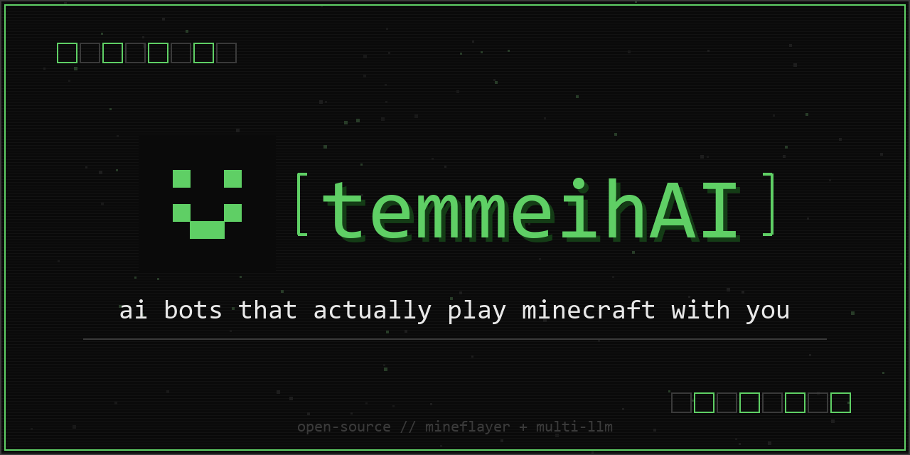

# temmeihAI

ai bots that actually play minecraft with you.

## what it does

invite a bot to your server, it joins and just lives there. walks around on its own, talks to people in chat, reacts to stuff happening around it. eats when it's hungry, panics when it's at 2 hearts, comments when it rains, greets new players. tell it to come over or follow you and it actually walks to you. you pick the provider (anthropic / openai / openrouter / gemini) and watch the token usage and cost tick up live on the dashboard.

## features

**chat**
- multi-provider with live key check and real model list
- custom personality prompt
- 40-message in-memory history, wiped on disconnect
- message batching, multiple players talking at once get one combined reply
- chat sanitization, strips server `/commands` and junk
- prompt-injection guard, catches "ignore your instructions" type stuff

**movement**
- wanders its local area on its own when nothing else is going on
- comes to you, follows you, tails you from a distance, leads you somewhere, walks to coordinates, stops, waits at a spot, runs from danger
- remembers spots you name ("this is home" then later "go home"), runs a route of several spots in order, patrols back and forth between spots until told to stop
- goes back to where it was before a detour
- climbs to higher ground, finds a safe way down, tries to reach a player up on a ledge
- heads for a torch or lantern when it's dark, walks in or out through a door, comes to whoever's lowest on health
- gestures: waves, nods, shakes its head, bows, turns around, looks behind it, jumps around to celebrate
- jumps, crouches, changes speed between sneak / walk / sprint
- it picks all of this itself through the model's tool calls, so it acts because it decided to, not because a keyword matched
- runs on pathfinder for the actual walking: parkour, jumping gaps, swimming, opening doors, avoiding lava and other hazards
- arrival is only reported when it physically gets there, and it tells you honestly if it can't find a path or gets stuck
- one thing at a time, with an order to it: surviving comes before your commands, your commands come before its own wandering

**world awareness**
the bot gets a `[current game state: ...]` line every turn with health, hunger, position, dimension, biome, time of day, weather, held item, inventory, nearby players + mobs, xp level. light version for idle chatter, full version for real conversations and combat.

**survival**
- auto-eats when hunger drops, knows ~40 food items, swaps back to whatever it was holding
- runs from danger when it's low and something hostile is close
- damage source tracking so it knows what hit it

**reacts to stuff (each with its own cooldown so it doesn't spam)**
- arrival line on first spawn
- player joined / left
- low health, took damage (says what hit it), death
- xp level up
- nightfall / daybreak
- rain start/stop, thunderstorm
- biome change
- item pickup
- watching another player attack something nearby
- advancements other players earn
- idle chatter when it's been quiet

**reliability**
- auto-reconnect on kick/disconnect/error, 5 tries 5s apart
- session timer is wall-clock so reconnecting doesn't reset it
- clean shutdown, clears everything and wipes memory on exit
- 60s timeout on llm calls, retries once on a hiccup

**dashboard**
- adjustable session length, 5 to 30 min
- optional cost cap, auto-stops if it spends too much
- live countdown, warns under a minute
- provider/model + live token + cost meter with projection
- countdown when you hit the spawn cooldown
- scrollable model list with keyboard nav

**security**
- 1 bot per ip, 1 spawn per 5 min, rate limited
- server gets pinged before spawn so you get a clear error instead of a hang
- full input validation

## setup

```bash
pip install -r requirements.txt
cd main/backend && npm install
```

run:

```bash
cd main/backend
python main.py
```

open http://localhost:3000

## how to use

1. open the dashboard, click create bot
2. server ip, port, version, bot name
3. pick provider, paste api key (it verifies and pulls the real model list)
4. pick model, optional personality, session length, optional cost cap
5. bot joins and starts doing its thing

then just talk to it in chat. try "come here", "follow me", "go to 100 64 -200", "stop", "this is home", "go home", "wait here", "climb up", "wave", "patrol between home and the gate".

## project layout

```
main/
  site/                        frontend
    index.html  about.html  start.html
    css/  js/
  backend/                     fastapi server
    main.py                    entry
    config.py  logger.py  db.py  llm.py
    routes/
      bot.py                   spawn / status / stop / history
      chat.py                  chat proxy + key verify
    bot/                       node mineflayer bot
      run.js                   entry
      ctx.js                   shared state + args
      config.js                thresholds, ranges, food/hostile sets
      log.js  cooldowns.js  history.js
      llm.js                   provider calls + tool calling
      tools.js                 tool definitions the bot can call
      state.js                 world state + entity helpers
      damage.js  sanitize.js  sounds.js  intents.js  drops.js
      speech.js                chat, context, runs tool calls
      session.js               connect / reconnect / shutdown
      handlers.js              all the bot event listeners
      ping.js                  server reachability check
      movement/                the movement system
        config.js              all movement tuning
        pathfinder.js          pathfinder setup + goal helpers
        actions.js             jump, sneak, sprint, look, stop
        controller.js          mode state machine + priorities
        goals.js               come, follow, goto, flee, climb, descend, doors, light
        waypoints.js           named spots, routes, patrol
        gestures.js            wave, nod, bow, turn, celebrate
        wander.js              roams on its own
        combat-move.js         dodge, keep distance, retreat
        social.js              personal space, mirror a player
        poi.js                 finds interesting nearby spots to wander to
        watchdog.js            lost-target / flee timeout / guard return
        index.js               init + public api
```

## coming soon

- combat, actually fighting back instead of just running
- mining and gathering
- live chat feed on the dashboard

## license

apache 2.0
